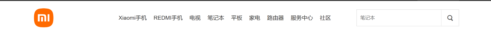
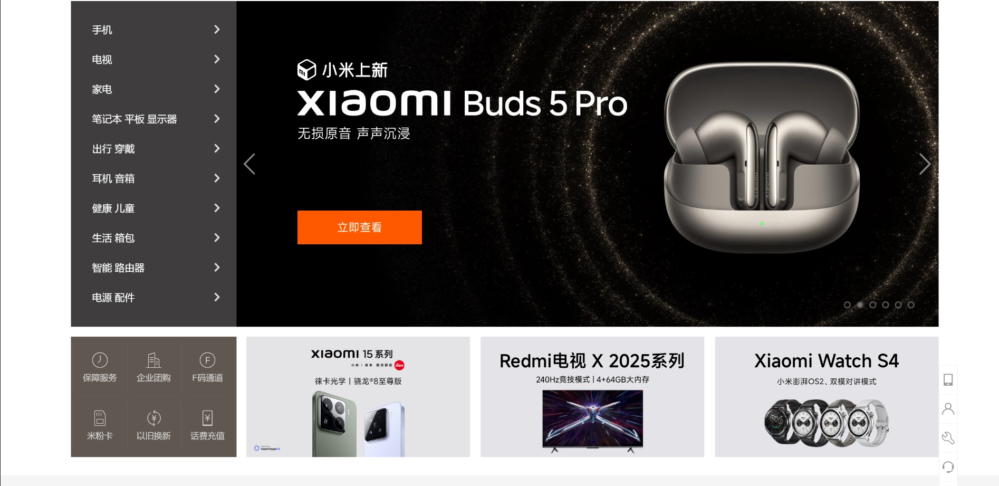

# 第一次提交时间:2025-3-15 17:30

> 尝试了第一周的任务 花费 6h 左右;
> 不太熟练

## 小结 20：18 45min

1. 顶部导航外层采用了 flex 布局，内层采用 float 布局
   
2. 次顶部导航栏部分采用了多层 flex
   
3. 剩下的主体部分显示采用了网格布局划分上下区域并设置间隔 gap

    - 上区域的左边栏使用了绝对定位
        - 左边栏内部使用了 flex 布局
    - 下区域使用网格布局划分四个区域，并设置间隔 gap
        - 第一个区域再使用网格布局划分六个区域，然后使用伪元素选择器修饰细节
        - 剩下三个区域

4. 静态页面中的小图标大多采用背景图片的方式

# 第二次提交 2-19 19:00-21:00

> 优化侧边栏的图标，将“>"改为图标箭头，并添加 hover 效果

> 添加左下角棕色部分文字上方的图标

> 优化轮播图静态部分的细节
>
> > 添加的左右箭头及右下角的点，及其 hover 效果

> 填充部分官网真实文字

> 微调了.main .box-top 的布局方式

> 优化了 css 的代码结构，按照 html 结构进行了文件分组

# 第三次提交 2-20 22：00-23：50

> 更改了侧栏的图标，所有箭头图标统一使用 icon-silder.png
> 添加了右下图片的 hover 阴影效果
> 新增了 banner.js
> 添加了手动轮播和自动轮播的效果以及右下角圆点的切换轮播图效果

# 第四次提交

预计新增：

1. 侧边栏图标的 hover 效果
2. 顶部栏的 hover 效果

# 第五次提交 第二周作业 3/27 22:25

1.实现了增加 todo 功能 2.实现了 localstorage 存储功能 3.实现了删除功能 4.实现了简易修改功能，未与 css 动画结合，待优化

# 第六次提交 3/28 22:25

> 除了拖拽功能，回收站功能，过渡动画，其他功能均已复现。

# 第三周 4/7 4/8 5\*45min

> 1. 界面及 drag 拽功能
