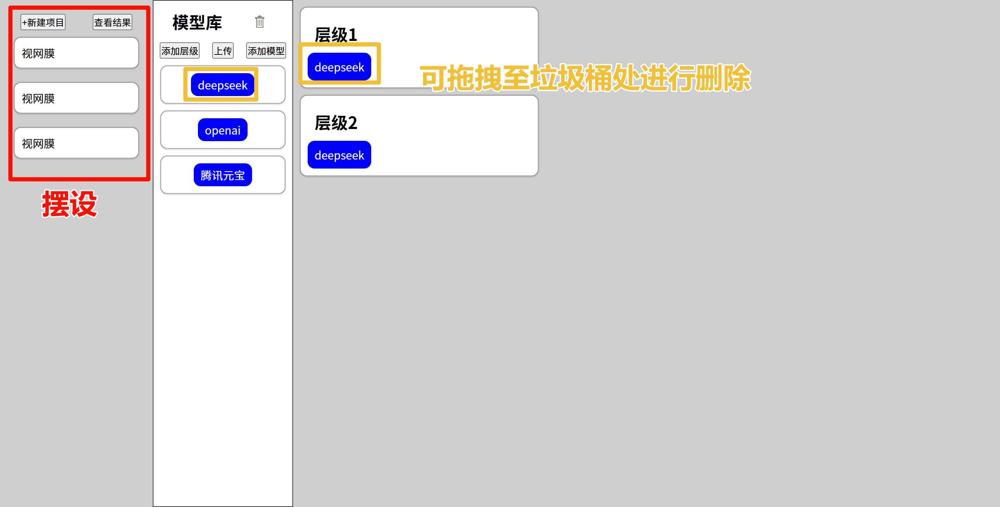

完成程度概述
1. 
    - 基础：提供⾄少上⾯⽰例的三个模型库供⽤⼾使⽤ --完成
    - 进阶：支持用户上传和删除模型功能 --完成(拖拽到垃圾桶图标进行删除)
2.  
    - 基础：实现拖拽模型库中的模型到右边的工作台展示 --完成
    - 进阶：允许用户任意增加层级，同一个层级可以存放多个模型内容 --完成
    - 进阶：允许用户拖拽错误的模型删除功能 --完成(拖拽到垃圾桶图标进行删除)
    - 进阶：点击选择的模型可以附加权重，提示词属性 --完成
    - 补充：当删去层级中最后一个模型时，自动删除该层级 --完成
3. 
    - 基础：实现将用户选择的模型映射成相印的数据结构模式 --完成
    - 进阶：将收集的模型信息发送到服务端 --未完成

